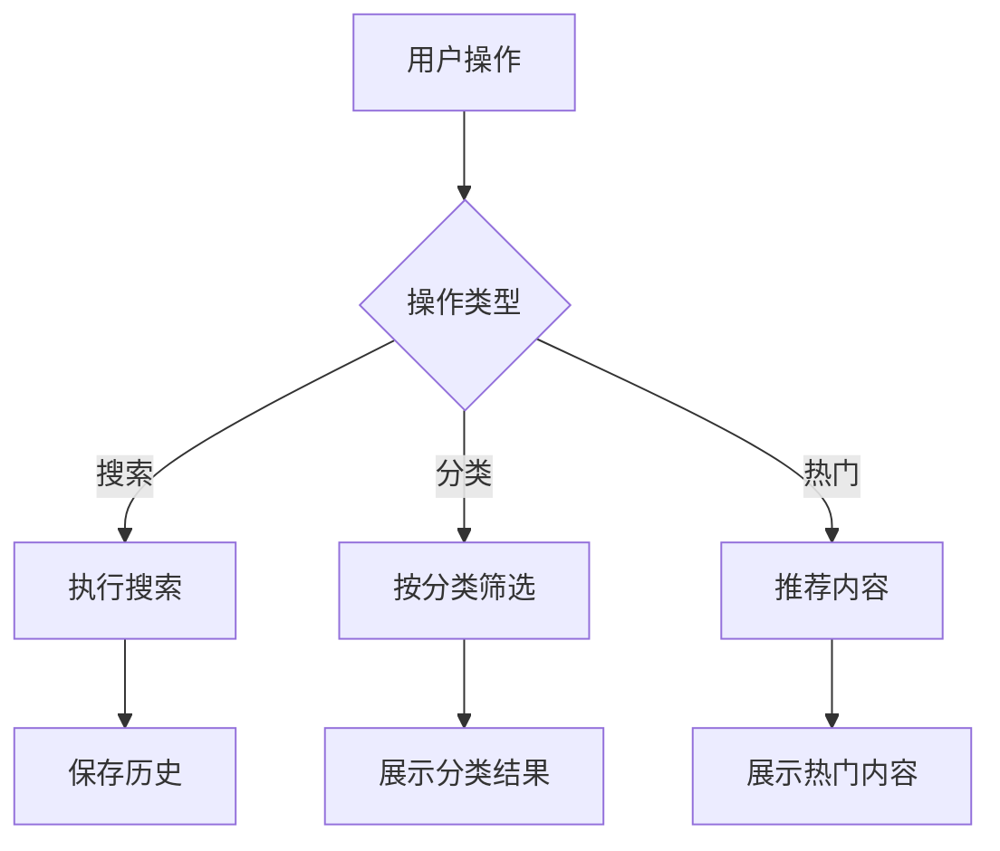
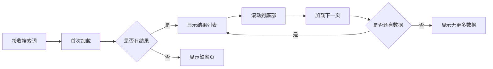
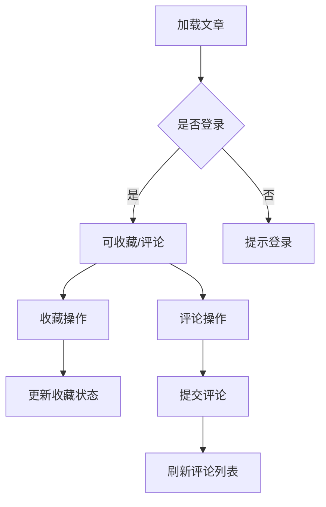
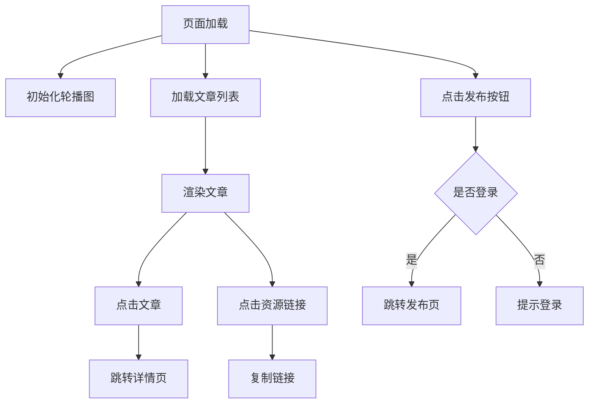
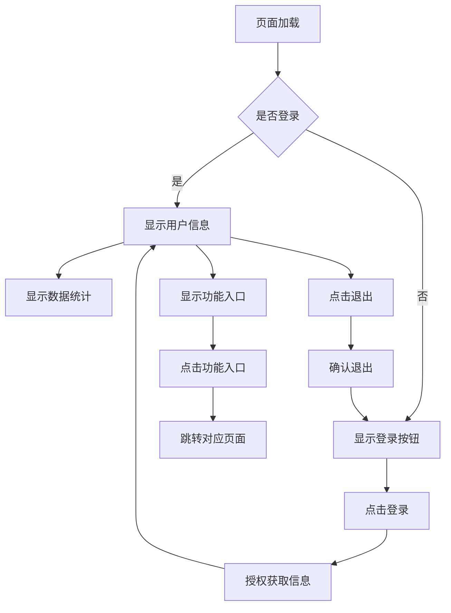
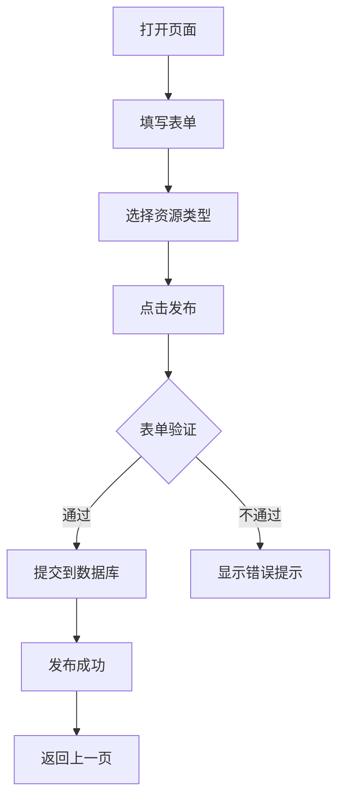

# 2025实习小程序功能说明文档（PPT版）

## 文档说明

本文档包含小程序所有功能页面的详细说明，适合用于制作PPT演示文稿。每个页面包含：

- 功能概述
- 界面示意图
- 核心代码片段
- 交互流程图
- 技术实现要点

> 提示：可将各部分内容直接复制到PPT中，每个功能模块单独一页幻灯片

## 首页 (pages/index)

### 功能概述


首页是小程序的主要入口，提供以下核心功能：

#### 1\. 资源搜索功能

```javascript
// 搜索功能完整实现
handleSearch() {
  const keyword = this.data.keyword.trim()
  if (!keyword) {
    wx.showToast({ title: '请输入关键词', icon: 'none' })
    return
  }
  
  // 保存搜索历史
  let history = wx.getStorageSync('searchHistory') || []
  history = [keyword, ...history.filter(item => item !== keyword)].slice(0, 10)
  wx.setStorageSync('searchHistory', history)
  
  // 跳转结果页
  wx.navigateTo({
    url: `/pages/searchResult/searchResult?keyword=${encodeURIComponent(keyword)}`
  })
  
  // 更新搜索历史显示
  this.setData({ history })
}
```


#### 2\. 分类浏览功能

```javascript
// 分类点击处理
handleCategoryTap(e) {
  const { id, name } = e.currentTarget.dataset
  wx.navigateTo({
    url: `/pages/searchResult/searchResult?category=${id}&title=${name}`
  })
}
```


#### 3\. 热门推荐功能

```javascript
// 获取热门推荐
loadHotKeywords() {
  wx.cloud.callFunction({
    name: 'getHotKeywords'
  }).then(res => {
    this.setData({ hotKeywords: res.result })
  })
}
```

### 交互流程图



1. **搜索区域**

   - 搜索输入框：可输入资源名称、作者或关键词
   - 搜索按钮：点击执行搜索
   - 清除按钮：清空输入内容
2. **热门搜索**

   - 显示8个热门关键词标签
   - 点击标签直接搜索该关键词
3. **搜索历史**

   - 显示最近10条搜索记录
   - 可点击历史记录重新搜索
   - 支持删除单条记录或清空全部
4. **资源分类**

   - 8个分类图标：电影、电子书、音乐、软件、教程、文档、图片、压缩包
   - 点击分类显示该分类下的资源列表
5. **资源卡片**

   - 显示资源标题、来源、大小和时间
   - 提供两个操作按钮：
     - 复制链接：复制资源下载链接
     - 查看资源：复制链接并打开夸克小程序

### 交互流程

1. 搜索流程：

   - 输入关键词 → 点击搜索 → 跳转到搜索结果页
   - 或直接点击热门关键词/历史记录
2. 分类浏览流程：

   - 点击分类图标 → 显示该分类资源列表
   - 点击资源卡片按钮进行操作
3. 历史记录管理：

   - 左滑单条记录删除
   - 点击"清除"按钮清空全部

### 技术说明

- 使用微信小程序的本地存储保存搜索历史
- 分类数据通过API请求获取
- 资源类型根据文件扩展名自动识别

## 搜索结果页 (pages/searchResult)

### 功能概述


展示用户搜索关键词匹配的资源列表，包含以下核心功能：

#### 1\. 搜索结果展示

```javascript
// 加载搜索结果
loadSearchResults(keyword, page = 1) {
  wx.cloud.callFunction({
    name: 'searchResources',
    data: { keyword, page }
  }).then(res => {
    const { results, total } = res.result
    this.setData({
      resources: page === 1 ? results : [...this.data.resources, ...results],
      total,
      page,
      hasMore: results.length >= 10
    })
  })
}
```


#### 2\. 分页加载功能

```javascript
// 分页加载完整实现
onReachBottom() {
  if (this.data.isLoading || !this.data.hasMore) return
  
  this.setData({ isLoading: true })
  this.loadSearchResults(this.data.keyword, this.data.page + 1)
    .finally(() => {
      this.setData({ isLoading: false })
      wx.stopPullDownRefresh()
    })
}
```

#### 3\. 资源操作功能

```javascript
// 复制资源链接
handleCopyLink(e) {
  const { link } = e.currentTarget.dataset
  wx.setClipboardData({
    data: link,
    success: () => wx.showToast({ title: '链接已复制' })
  })
}

// 查看资源详情  
handleViewResource(e) {
  const { link } = e.currentTarget.dataset
  wx.navigateToMiniProgram({
    appId: '夸克小程序AppID',
    path: `/pages/webview?url=${encodeURIComponent(link)}`
  })
}
```

### 交互流程图



1. **顶部搜索栏**

   - 显示当前搜索关键词
   - 可修改关键词重新搜索
   - 清除按钮可清空输入
2. **结果列表**

   - 正常搜索结果：
     - 资源卡片显示标题、来源、类型、大小和时间
     - 提供"复制链接"和"查看资源"按钮
   - 默认数据展示：
     - 当无搜索结果时显示推荐资源
     - 仅提供"复制链接"按钮
3. **加载状态提示**

   - 加载中：显示加载动画
   - 无更多数据：显示底部提示
   - 无结果：显示提示信息

### 交互流程

1. 搜索流程：

   - 从首页带关键词跳转过来自动搜索
   - 在顶部搜索栏可修改关键词重新搜索
   - 上拉加载更多结果
2. 资源操作：

   - 复制链接：复制资源URL到剪贴板
   - 查看资源：复制链接并打开夸克小程序

### 技术说明

- 使用分页加载优化性能
- 通过全局变量传递搜索关键词
- 无结果时显示默认推荐数据

## 中心页 (pages/Center)

### 功能概述


展示文章详情，包含以下核心功能：

#### 1\. 文章详情展示

```javascript
// 加载文章详情
loadArticleDetail(articleId) {
  wx.cloud.callFunction({
    name: 'getArticleDetail',
    data: { articleId }
  }).then(res => {
    this.setData({
      article: res.result.article,
      isFavorited: res.result.isFavorited,
      favoriteCount: res.result.favoriteCount
    })
  })
}
```


#### 2\. 收藏功能

```javascript
// 完整收藏功能实现
handleFavorite() {
  if (!this.checkLogin()) {
    wx.showToast({ title: '请先登录', icon: 'none' })
    return
  }

  const db = wx.cloud.database()
  const method = this.data.isFavorited ? 'remove' : 'add'
  
  // 更新收藏状态
  db.collection('favorites')[method]({
    data: { 
      articleId: this.data.article._id,
      createdAt: new Date()
    }
  }).then(() => {
    // 更新UI状态
    this.setData({
      isFavorited: !this.data.isFavorited,
      favoriteCount: this.data.isFavorited ? 
        this.data.favoriteCount - 1 : 
        this.data.favoriteCount + 1
    })
  
    wx.showToast({
      title: this.data.isFavorited ? '已取消收藏' : '收藏成功',
      icon: 'success'
    })
  })
}
```

#### 3\. 评论功能

```javascript
// 提交评论
submitComment() {
  if (!this.checkLogin()) return
  
  const db = wx.cloud.database()
  db.collection('comments').add({
    data: {
      articleId: this.data.article._id,
      content: this.data.commentContent,
      createdAt: new Date(),
      userInfo: getApp().globalData.userInfo
    }
  }).then(() => {
    this.loadComments()
    this.setData({ commentContent: '' })
    wx.showToast({ title: '评论成功', icon: 'success' })
  })
}

// 加载评论
loadComments() {
  const db = wx.cloud.database()
  db.collection('comments')
    .where({ articleId: this.data.article._id })
    .orderBy('createdAt', 'desc')
    .get()
    .then(res => {
      this.setData({ comments: res.data })
    })
}
```

### 交互流程图



1. **顶部作者信息**

   - 作者头像和昵称
   - 文章发布时间
2. **操作按钮区**

   - 收藏按钮：显示收藏状态和收藏数
   - 评论按钮：打开/关闭评论输入框
3. **内容区**

   - 文章标题和正文
   - 资源链接（可点击复制）
4. **评论区**

   - 评论输入框：支持回复特定评论
   - 评论列表：显示所有评论及回复
   - 每条评论可展开回复输入框

### 交互流程

1. 收藏流程：

   - 点击收藏按钮 → 检查登录 → 更新收藏状态
   - 已收藏可取消收藏
2. 评论流程：

   - 点击"写评论" → 输入内容 → 发送
   - 回复评论 → 输入内容 → 发送
3. 资源操作：

   - 点击资源链接 → 复制到剪贴板

### 技术说明

- 使用云数据库存储文章、评论和收藏数据
- 实时更新评论和收藏状态
- 支持嵌套回复结构

## 社区页面 (pages/detail)

### 功能概述


社区页面展示用户分享的资源文章，主要功能包括：

#### 1\. 轮播图功能

```javascript
// 轮播图配置
data: {
  swiperImages: [
    '/assets/swipers/1.jpg',
    '/assets/swipers/2.jpg', 
    '/assets/swipers/3.jpg'
  ],
  autoplay: true,
  interval: 3000,
  circular: true
}
```


#### 2\. 文章列表加载

```javascript
// 加载文章列表
async loadArticles() {
  try {
    const db = wx.cloud.database()
    const res = await db.collection('articles')
      .orderBy('time', 'desc')
      .get()

    let articles = res.data.map(item => ({
      ...item,
      preview: item.content.substring(0, 30) + '...',
      displayTime: new Date(item.time).toLocaleDateString()
    }))
  
    this.setData({ articles })
  } catch (e) {
    wx.showToast({ title: '加载失败', icon: 'none' })
  }
}
```

#### 3\. 资源链接复制

```javascript
// 复制资源链接
copyLink(e) {
  const link = e.currentTarget.dataset.link
  wx.setClipboardData({
    data: link,
    success: () => wx.showToast({ title: '已复制' })
  })
}
```

#### 4\. 发布功能

```javascript
// 跳转发布页
toPublish() {
  if (!getApp().globalData.isLoggedIn) {
    wx.showModal({
      title: '请先登录',
      content: '登录后才能发布内容',
      success: (res) => {
        if (res.confirm) {
          wx.navigateTo({
            url: '/pages/userCenter/userCenter'
          })
        }
      }
    })
    return
  }
  wx.navigateTo({
    url: '/pages/settings/settings'
  })
}
```

### 交互流程图



### 技术说明

1. **数据加载**

   - 使用云数据库articles集合
   - 按时间倒序排列
   - 自动截取内容预览
2. **权限控制**

   - 发布功能需登录
   - 未登录跳转个人中心
3. **性能优化**

   - 分页加载文章
   - 本地缓存文章数据

## 个人中心页 (pages/userCenter)

### 功能概述


个人中心页面管理用户账号和提供快捷入口：

#### 1\. 用户登录功能

```javascript
// 微信授权登录
getUserProfile(e) {
  if (!e.detail.userInfo) {
    wx.showToast({ title: '请先授权', icon: 'none' })
    return
  }

  // 保存用户信息
  const app = getApp()
  app.globalData.userInfo = e.detail.userInfo
  app.globalData.isLoggedIn = true
  
  // 更新UI
  this.setData({
    isLoggedIn: true,
    userInfo: e.detail.userInfo
  })
  
  // 获取用户数据
  this.updateUserStats()
}
```

#### 2\. 数据统计功能

```javascript
// 更新用户数据统计
async updateUserStats() {
  const app = getApp()
  
  // 获取收藏数
  const favRes = await wx.cloud.callFunction({
    name: 'getFavoriteCount'
  })
  
  // 获取发布数  
  const postRes = await wx.cloud.callFunction({
    name: 'getPostCount'
  })

  this.setData({
    stats: [
      { label: '收藏', value: favRes.result.count },
      { label: '发布', value: postRes.result.count }
    ]
  })
}
```

#### 3\. 功能入口处理

```javascript
// 跳转功能页面
navigateTo(e) {
  const url = e.currentTarget.dataset.url
  wx.navigateTo({ url })
}
```

#### 4\. 退出登录功能

```javascript
// 退出登录
logout() {
  wx.showModal({
    title: '确认退出',
    content: '确定要退出当前账号吗？',
    success: (res) => {
      if (res.confirm) {
        const app = getApp()
        app.globalData.isLoggedIn = false
        app.globalData.userInfo = null
      
        this.setData({
          isLoggedIn: false,
          userInfo: null,
          stats: [
            { label: '收藏', value: 0 },
            { label: '发布', value: 0 }
          ]
        })
      }
    }
  })
}
```

### 交互流程图



### 技术说明

1. **用户认证**

   - 使用微信开放接口获取用户信息
   - 全局管理登录状态
   - 自动更新用户数据
2. **数据统计**

   - 实时查询云数据库
   - 缓存统计结果
   - 自动刷新显示
3. **状态管理**

   - 全局变量存储用户信息
   - 本地缓存登录状态
   - 退出时清除数据
4. **页面跳转**

   - 动态路由配置
   - 参数传递
   - 返回处理

## 发布页面 (pages/settings)

### 功能概述


资源发布页面包含完整的表单提交功能：

#### 1\. 表单初始化

```javascript
data: {
  form: {
    title: '',
    content: '',
    link: '',
    linkText: '文档' // 默认资源类型
  },
  resourceTypes: ['文档','视频','音频','图片','压缩包'],
  isSubmitting: false
}
```

#### 2\. 表单输入处理

```javascript
// 输入框变化处理
handleInputChange(e) {
  const { field } = e.currentTarget.dataset
  this.setData({
    [`form.${field}`]: e.detail.value
  })
}

// 资源类型选择
handleTypeChange(e) {
  this.setData({
    'form.linkText': this.data.resourceTypes[e.detail.value]
  })
}
```

#### 3\. 表单验证

```javascript
validateForm() {
  const { title, content } = this.data.form
  
  if (!title.trim()) {
    wx.showToast({ title: '请输入标题', icon: 'none' })
    return false
  }
  
  if (!content.trim()) {
    wx.showToast({ title: '请输入内容', icon: 'none' })
    return false
  }

  if (this.data.form.link && !/^https?:\/\//.test(this.data.form.link)) {
    wx.showToast({ title: '请输入有效的链接', icon: 'none' })
    return false
  }

  return true
}
```

#### 4\. 提交发布

```javascript
async submitForm() {
  if (!this.validateForm() || this.data.isSubmitting) return
  
  this.setData({ isSubmitting: true })
  
  try {
    const db = wx.cloud.database()
    const userInfo = getApp().globalData.userInfo
  
    const newArticle = {
      title: this.data.form.title,
      content: this.data.form.content,
      link: this.data.form.link || '',
      linkText: this.data.form.linkText,
      author: userInfo.nickName,
      avatar: userInfo.avatarUrl,
      time: new Date()
    }

    await db.collection('articles').add({ data: newArticle })
  
    wx.showToast({ title: '发布成功', icon: 'success' })
    setTimeout(() => wx.navigateBack(), 1500)
  } catch (e) {
    wx.showToast({ title: '发布失败', icon: 'none' })
  } finally {
    this.setData({ isSubmitting: false })
  }
}
```

### 交互流程图



### 技术说明

1. **表单控制**

   - 实时校验输入内容
   - 防止重复提交
   - 自动填充用户信息
2. **数据存储**

   - 使用云数据库存储文章
   - 自动添加时间戳
   - 关联用户信息
3. **用户体验**

   - 发布中状态提示
   - 成功自动返回
   - 错误友好提示
